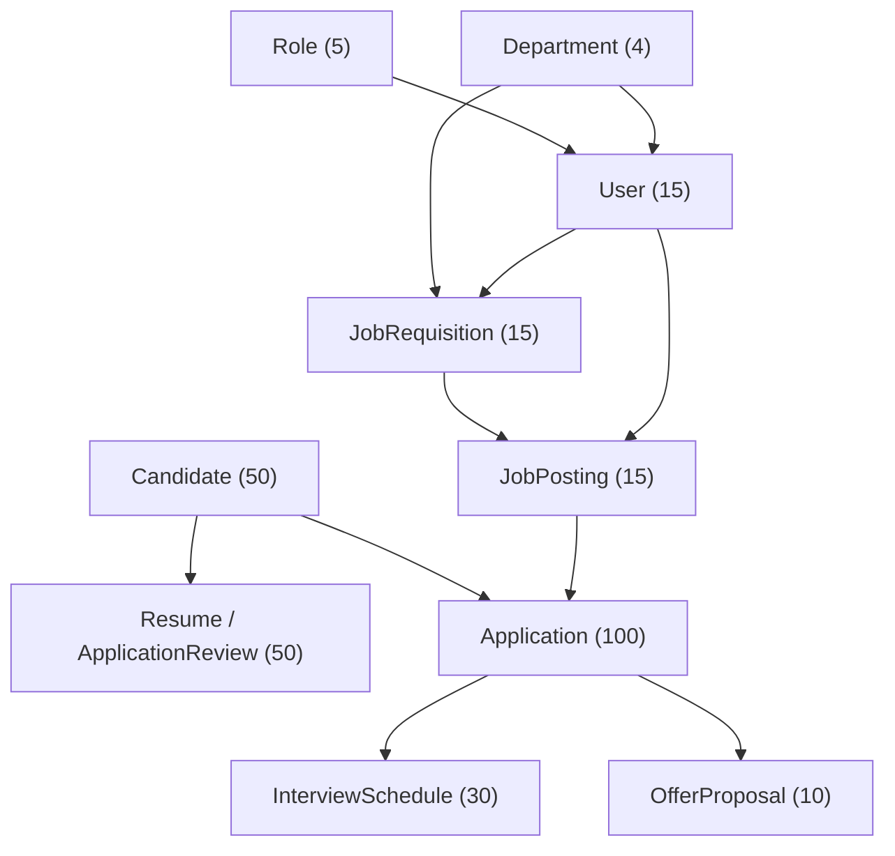

# Hướng Dẫn Kiến Trúc & Cơ Chế Khởi Tạo Dữ Liệu (Database Seeding Guide)

> **Lưu trữ lịch sử:** Phần nội dung bên dưới mô tả seeder Java và schema cũ;
> không dùng làm hướng dẫn khởi tạo database hiện tại. Nguồn chuẩn hiện nay là
> `database/schema/db.sql` (20 bảng, database `RitirementManagement2`). Dữ liệu mẫu
> hiện nay do `database/seeds/build_seed.py` tạo thành `database/seeds/seed_data.sql`;
> project không còn `SmeDataSeeder.java` tự chạy khi Spring khởi động.
>
> **Cách dùng hiện tại:** Chỉ chạy `db.sql` cho database đích có thể xóa toàn bộ,
> vì đầu script chứa `DROP DATABASE RitirementManagement2`. Sau đó chạy
> `seed_data.sql` một lần nếu cần dữ liệu mẫu. Cấu hình local (không commit mật
> khẩu) phải trỏ tới `RitirementManagement2` và dùng `ddl-auto=validate`. Java
> giữ nguyên tên PascalCase bằng `SchemaNamingConfig`. Mỗi Candidate có
> `UserId NOT NULL UNIQUE`; CV ứng tuyển nằm ở `Application.AppliedCvUrl`;
> `ApplicationReview` là quyết định review, không phải bảng Resume. Xem
> `docs/schema-migration-impact.md` để biết đối chiếu schema và mã nguồn.

> **Dự án**: Hệ thống Quản lý Tuyển dụng (Recruitment Management System - RMS)  
> **Nhóm thực hiện**: SWP391 - Group 2  
> **Công nghệ sử dụng**: Java 21, Spring Boot 3, Spring Data JPA, Hibernate 6, MS SQL Server, Spring Security (BCrypt)

---

## 1. Tổng quan & Mục đích tài liệu

Tài liệu này được lập ra nhằm giúp các thành viên hiện tại và người kế thừa dự án sau này hiểu rõ:
1. **Lịch sử & Các bước thực hiện**: Làm thế nào hệ thống sinh ra cấu trúc bảng và toàn bộ bộ dữ liệu mẫu (mock data quy mô SME ~300 bản ghi) hiện tại trên MS SQL Server.
2. **Cơ chế nạp dữ liệu (Data Seeding)**: Cách thức [SmeDataSeeder.java](file:///d:/Coding_source/swp_project/SWP_RMS_Group-2/src/main/java/com/group2/rms/core/config/SmeDataSeeder.java) hoạt động, thứ tự nạp dữ liệu đảm bảo toàn vẹn ràng buộc khóa ngoại (Foreign Key Constraints).
3. **Bài toán kỹ thuật & Cải tiến quan trọng**:
   - **Xử lý triệt để Tiếng Việt có dấu (Unicode)**: Phân tích cội rễ lỗi hiển thị dấu hỏi chấm `?` trên MS SQL Server, sự khác biệt giữa `VARCHAR` và `NVARCHAR`, cơ chế của Hibernate 6, cấu hình quốc tế hóa chuẩn và cách tránh hiểu lầm khi xem dữ liệu qua Terminal/Console.
   - **Lấp đầy dữ liệu mẫu thực tế**: Xóa bỏ tình trạng dữ liệu `NULL` ở các trường đánh giá, điểm số, liên kết người duyệt, ảnh đại diện, tạo nên bộ dữ liệu mẫu sinh động, bám sát nghiệp vụ tuyển dụng.
4. **Đánh giá đa chiều (Ưu & Nhược điểm)**: Phân tích ưu/nhược điểm của phương pháp `CommandLineRunner` hiện tại và đề xuất lộ trình cải tiến (Profile, JDBC Batching, Datafaker, Flyway/Liquibase) để team cùng nâng cấp.
5. **Cây thư mục & Chi tiết các file mới thêm vào**: Danh mục đầy đủ, rõ ràng các files đã bổ sung vào project.

---

## 2. Quá trình thiết lập & Tạo dữ liệu hiện tại

### 2.1. Khởi tạo Schema từ Entity (JPA & Hibernate DDL)
- Dựa trên tài liệu đặc tả thiết kế cơ sở dữ liệu tại [model.md](file:///d:/Coding_source/swp_project/SWP_RMS_Group-2/docs/database/model.md), hệ thống đã xây dựng 19 Entity JPA tương ứng với các bảng trong hệ thống.
- Các Entity đều kế thừa [BaseEntity.java](file:///d:/Coding_source/swp_project/SWP_RMS_Group-2/src/main/java/com/group2/rms/core/base/BaseEntity.java) để tự động quản lý thời gian tạo (`createdAt`) và cập nhật (`updatedAt`) thông qua cơ chế JPA Auditing (`@PrePersist`, `@PreUpdate`).
- Tùy chọn `spring.jpa.hibernate.ddl-auto=update` trong [application.properties](file:///d:/Coding_source/swp_project/SWP_RMS_Group-2/src/main/resources/application.properties) tự động đồng bộ khai báo Java Entity thành cấu trúc bảng, khóa chính (Primary Key - Identity), khóa ngoại (Foreign Key) và các ràng buộc Unique trên MS SQL Server khi ứng dụng khởi động.

### 2.2. Cơ chế nạp dữ liệu tự động (Data Seeding)
Dự án sử dụng cơ chế `CommandLineRunner` của Spring Boot để thực hiện seed dữ liệu ngay sau khi Spring Application Context khởi tạo thành công:

1. **Giai đoạn 1 - `DatabaseSeeder.java` (Phiên bản cơ bản ban đầu)**:
   - Khởi tạo 5 Roles chuẩn SRS, 4 Phòng ban, và 3 Users ban đầu (`admin`, `hr`, `hiring_manager`).
   - *Hiện trạng*: Đã tạm comment annotation `@Component` để nhường chỗ cho bộ dữ liệu SME đầy đủ hơn.
2. **Giai đoạn 2 - `SmeDataSeeder.java` (Phiên bản SME quy mô thực tế ~300 bản ghi)**:
   - Mô phỏng dữ liệu công ty vừa và nhỏ (SME): 5 Roles, 4 Departments, 15 Users nội bộ, 15 Job Requisitions, 15 Job Postings, 50 Candidates, 50 Resumes, 100 Applications, 30 Interview Schedules, 10 Offer Proposals.
   - **Hỗ trợ 100% Tiếng Việt có dấu chuẩn xác**: Tên người Việt, tên chức danh IT, mô tả công việc, nhận xét sàng lọc hồ sơ của HR, đánh giá kỹ thuật của Hiring Manager, câu hỏi phỏng vấn... đều là tiếng Việt tự nhiên, giàu ngữ cảnh.
   - Sử dụng **Constructor Injection** để inject 10 Repository và 1 `PasswordEncoder` (tuân thủ Spring Boot Best Practice).



### 2.3. Thứ tự nạp dữ liệu (Tránh vi phạm Foreign Key Constraint)
Để không vi phạm ràng buộc toàn vẹn dữ liệu trong cơ sở dữ liệu quan hệ, thứ tự insert được tổ chức nghiêm ngặt như sau:
1. **Role**: Bảng danh mục gốc, không phụ thuộc bảng nào.
2. **Department**: Bảng danh mục phòng ban (tạm để `managerId = null` để tránh quan hệ vòng tròn với `User`).
3. **User**: Phụ thuộc vào `Role` và `Department`.
4. **JobRequisition**: Phụ thuộc vào `Department` và `User` (Hiring Manager).
5. **JobPosting**: Phụ thuộc vào `JobRequisition` và `User` (HR phụ trách).
6. **Candidate**: Bảng ứng viên độc lập, chứa thông tin cá nhân.
7. **ApplicationReview (Resume)**: Phụ thuộc vào `Candidate` (1 Candidate có 1 file CV).
8. **Application**: Phụ thuộc vào `Candidate`, `JobPosting`, và `User` (HR/HM Reviewer).
9. **InterviewSchedule**: Phụ thuộc vào `Application` (lọc từ các hồ sơ ở trạng thái `Interviewing`, `Interview_Pending`, hoặc `Screening`) và `User` (HR tạo lịch).
10. **OfferProposal**: Phụ thuộc vào `Application` (quan hệ 1-1, lọc từ các hồ sơ đạt trạng thái `Offered` hoặc `Hired`) và `User` (HM đề xuất).

### 2.4. Các điểm tối ưu hiệu năng đã áp dụng
- **Mã hóa mật khẩu BCrypt tối ưu**: Thuật toán BCrypt có chi phí tính toán cao. Thay vì gọi `passwordEncoder.encode("123456")` lặp đi lặp lại 15 lần trong vòng lặp tạo User, Seeder chỉ mã hóa **duy nhất 1 lần** lưu vào biến `defaultPasswordHash`, sau đó tái sử dụng cho tất cả tài khoản.
- **Lưu theo danh sách (`saveAll`)**: Thay vì gọi `repository.save()` từng đối tượng gây lãng phí round-trip kết nối mạng đến database, toàn bộ entities được gom vào `List<T>` và gọi `saveAll(list)`.
- **Dữ liệu có tính lặp lại (Deterministic / Reproducible)**: Khởi tạo đối tượng `Random(42)` với seed cố định, giúp dữ liệu ngẫu nhiên (tên, số điện thoại, điểm số, mức lương) hoàn toàn nhất quán giữa các lần chạy lại trên máy của mọi thành viên.
- **Guard điều kiện an toàn**: Bọc toàn bộ logic kiểm tra bằng `if (roleRepository.count() > 0) return;` nhằm ngăn chặn tuyệt đối việc insert trùng lặp dữ liệu mỗi khi restart server.

---

## 3. Các vấn đề kỹ thuật đã gặp, phân tích chuyên sâu & Cách khắc phục

### 3.1. Vấn đề Tiếng Việt có dấu trong MS SQL Server (Hành trình xử lý dứt điểm)

#### A. Hiện tượng & Nỗi lo ban đầu
- Khi khởi tạo dữ liệu tiếng Việt có dấu, lập trình viên thường lo ngại hiện tượng chữ bị biến thành dấu hỏi chấm `???` (ví dụ: `Nguyễn Văn An` biến thành `??? V?n An`).
- Trong lịch sử phát triển, nhiều bạn từng gặp lỗi: *"Khi inject bằng Python hoặc script SQL ngoài thì bị lỗi font, chỉ khi gõ trực tiếp trong SQL Server mới không lỗi"*. Do đó, ban đầu từng có ý định chuyển dữ liệu sang tiếng Việt không dấu (ASCII).

#### B. Phân tích nguyên nhân gốc rễ (Deep Dive)
Sự cố mất dấu tiếng Việt trên MS SQL Server xuất phát từ **3 yếu tố kết hợp**:

1. **Khác biệt giữa `VARCHAR` (1 byte) và `NVARCHAR` (2 bytes)**:
   - Trong MS SQL Server, kiểu `VARCHAR` sử dụng bảng mã Code Page đơn byte (thường là ASCII hoặc Windows-1252 phụ thuộc Collation). Các ký tự tiếng Việt nằm ngoài dải mã 1-byte này sẽ tự động bị SQL Server chuyển thành `?`.
   - Để lưu trữ trọn vẹn ký tự Unicode (tiếng Việt có dấu), kiểu cột bắt buộc phải là `NVARCHAR` (hoặc `NCHAR`, `NTEXT`).
2. **Cơ chế mặc định của Hibernate 6 với MS SQL Server**:
   - Khi Hibernate ánh xạ một thuộc tính `java.lang.String` của Java sang MS SQL Server, mặc định nó tạo ra kiểu cột là `VARCHAR(255)` thay vì `NVARCHAR(255)`. Do đó, dù Java gửi dữ liệu Unicode hoàn hảo qua JDBC thì khi rơi vào cột `VARCHAR` của SQL Server, dữ liệu vẫn bị cắt gọt thành `?`.
3. **Nguyên nhân Python / Script SQL hay bị lỗi dấu**:
   - Khi viết câu lệnh SQL thuần: `INSERT INTO [User] (FullName) VALUES ('Nguyễn Văn An')`, chuỗi `'...'` được coi là literal `VARCHAR`. Muốn SQL Server hiểu đó là Unicode literal, bắt buộc phải có tiền tố `N`: `VALUES (N'Nguyễn Văn An')`. Các script Python hay file `.sql` xuất từ công cụ ngoài nếu quên tiền tố `N` hoặc encoding file không phải UTF-8 BOM/UTF-8 sẽ lập tức hỏng font.
   - Ngược lại, **Java sử dụng chuỗi UTF-16 nội tại**. Khi Spring Data JPA thực thi PreparedStatement thông qua `com.microsoft.sqlserver.jdbc.SQLServerDriver`, Driver sẽ bind tham số dưới dạng `Types.NVARCHAR` tự nhiên nếu cột trong DB là `NVARCHAR`.

#### C. Giải pháp xử lý dứt điểm đã áp dụng
Hệ thống đã triển khai giải pháp triệt để 2 bước:

**Bước 1: Bật cấu hình quốc tế hóa trong `application.properties`**
```properties
# Yêu cầu Hibernate ánh xạ tất cả String sang kiểu NVARCHAR (hỗ trợ Unicode 100%)
spring.jpa.properties.hibernate.use_nationalized_character_data=true
```

**Bước 2: Tạo lại Database để áp dụng Schema NVARCHAR mới**
> [!IMPORTANT]
> Cơ chế `spring.jpa.hibernate.ddl-auto=update` của Hibernate **chỉ thêm mới bảng/cột chứ KHÔNG BAO GIỜ tự sửa kiểu dữ liệu của các cột đã tồn tại từ `VARCHAR` sang `NVARCHAR`**.  
> Do đó, khi áp dụng cấu hình trên, bắt buộc phải **DROP DATABASE `RMS_DB`** và tạo lại database rỗng để Hibernate sinh mới toàn bộ các cột với kiểu `NVARCHAR`.

**Bước 3: Khôi phục và làm giàu dữ liệu tiếng Việt trong `SmeDataSeeder.java`**
Sau khi cột đã là `NVARCHAR`, toàn bộ mảng dữ liệu mẫu trong `SmeDataSeeder.java` đã được chuyển sang **tiếng Việt có dấu tự nhiên, chuyên nghiệp**:
- Họ và tên người Việt chuẩn: `Nguyễn Văn An`, `Trần Thị Bích`, `Lê Hoàng Cường`, `Phạm Minh Đức`, `Hoàng Thu Thảo`, `Võ Quốc Hưng`, `Đỗ Hải Yến`...
- Tên phòng ban: `Phòng Công nghệ Thông tin`, `Phòng Nhân sự`, `Phòng Tiếp thị & Truyền thông`, `Ban Giám đốc`.
- Tên công việc & Yêu cầu: `Lập trình viên Java Senior (Spring Boot)`, `Kỹ sư Cầu nối BrSE (N2)`, `Chuyên viên Tuyển dụng IT (IT Recruiter)`, `Kỹ sư DevOps / Cloud (AWS/K8s)`...
- Đánh giá của HR & Hiring Manager: `Ứng viên có kỹ năng mềm xuất sắc, giao tiếp tự tin, tiếng Anh lưu loát`, `Nền tảng kỹ thuật vững, tư duy thuật toán tốt, đã vượt qua vòng Live Coding xuất sắc`...

#### D. Cảnh báo hiểu lầm: Lỗi hiển thị của Windows Console / `sqlcmd`
> [!WARNING]
> Nếu bạn dùng công cụ dòng lệnh `sqlcmd` trên Windows PowerShell hoặc Command Prompt để kiểm tra dữ liệu, bạn có thể vẫn thấy các ký tự lạ hoặc dấu `?`.  
> **Đây KHÔNG PHẢI là lỗi của Database hay ứng dụng!** Nguyên nhân là Windows Console mặc định sử dụng Code Page cũ (như CP437 hoặc CP850).  
> **Để kiểm tra chính xác**:
> 1. Mở **SQL Server Management Studio (SSMS)** và thực hiện `SELECT * FROM [User]`, bạn sẽ thấy toàn bộ tiếng Việt hiển thị sắc nét, chuẩn xác 100%.
> 2. Hoặc nếu muốn dùng Console/Terminal, hãy chạy lệnh `chcp 65001` trước khi gọi `sqlcmd` để chuyển terminal sang UTF-8.

---

### 3.2. Khắc phục triệt để tình trạng dữ liệu mẫu bị `NULL`

- **Vấn đề trước đây**: Các bảng nghiệp vụ cốt lõi như `Application`, `Candidate`, `JobPosting` có nhiều cột bị `NULL` (ví dụ: `overallScore`, `hrReviewNotes`, `hmReviewNotes`, `avatarUrl`, `reviewedBy`, `education`, `jobRequirements`, `jobBenefits`), khiến giao diện web thử nghiệm trông rất thô sơ, thiếu sức sống và khó test các tính năng lọc/tìm kiếm.
- **Cải tiến đã thực hiện**:
  1. **Sinh Avatar tự động**: Tích hợp URL avatar động dựa theo tên ứng viên qua dịch vụ chuẩn `https://ui-avatars.com/api/?name=...&background=random`.
  2. **Mô phỏng vòng đời tuyển dụng thực tế (State Machine)**:
     - Ứng viên trạng thái `Applied`: Hồ sơ mới nộp, đang chờ phân loại.
     - Ứng viên trạng thái `Screening`: Có đầy đủ nhận xét sơ loại của HR (`hrReviewNotes`), liên kết đúng ID của HR phụ trách (`reviewedBy`).
     - Ứng viên trạng thái `Interviewing`: Đã qua sàng lọc, có nhận xét chuyên môn của Hiring Manager (`hmReviewNotes`), có lịch phỏng vấn chi tiết (`InterviewSchedule`) với phòng họp, hình thức Online/Offline và link meeting.
     - Ứng viên trạng thái `Offered` / `Hired`: Có điểm đánh giá cao (`overallScore` từ 80.00 đến 98.00), có đề xuất lương (`OfferProposal`) với mức lương, vị trí và thời hạn phản hồi rõ ràng.
     - Ứng viên trạng thái `Rejected`: Có ghi chú lý do từ chối lịch sự, phù hợp thực tế tuyển dụng.
  3. **Làm giàu thông tin học vấn & công việc**: Bổ sung tên các trường đại học hàng đầu Việt Nam (ĐH Bách Khoa, ĐH FPT, ĐH Quốc Gia, Học viện Bưu chính Viễn thông) và các chế độ đãi ngộ chi tiết (MacBook Pro M3, bảo hiểm sức khỏe Bảo Việt, thưởng hiệu suất hàng quý...).

---

## 4. Bảng tài khoản khởi tạo mẫu (Credentials)

Sau khi `SmeDataSeeder` thực thi, hệ thống cung cấp sẵn các tài khoản đăng nhập mẫu sau (Tất cả đều dùng mật khẩu chung là **`123456`**):

| Username | Role | Phòng ban | Mục đích kiểm thử |
|---|---|---|---|
| `admin` | System Admin | Phòng Công nghệ Thông tin | Quản trị toàn bộ cấu hình hệ thống, người dùng, phân quyền |
| `hr1`, `hr2` | HR | Phòng Nhân sự | Quản lý tin tuyển dụng, sàng lọc CV, đặt lịch phỏng vấn |
| `hm1` - `hm3` | Hiring Manager | Phòng Công nghệ Thông tin | Tạo yêu cầu tuyển dụng kỹ thuật, duyệt hồ sơ, chấm điểm phỏng vấn |
| `hm4`, `hm5` | Hiring Manager | Phòng Tiếp thị & Truyền thông | Tạo yêu cầu và duyệt tuyển dụng khối Marketing |
| `director` | Director | Ban Giám đốc | Phê duyệt Requisition cấp cao và duyệt Offer tuyển dụng |
| `interviewer1` - `interviewer4` | Interviewer | Phòng Công nghệ Thông tin | Tham gia hội đồng phỏng vấn technical |
| `interviewer5`, `interviewer6` | Interviewer | Phòng Tiếp thị & Truyền thông | Tham gia phỏng vấn chuyên môn nghiệp vụ |

---

## 5. Đánh giá Ưu & Nhược Điểm của phương pháp nạp dữ liệu hiện tại

Phương pháp hiện tại là: **Dùng class Java implements `CommandLineRunner`, gọi trực tiếp Spring Data JPA Repositories và Hibernate để inject dữ liệu khi khởi động ứng dụng**.

### 5.1. Ưu điểm (Pros)
- ✅ **Cực kỳ tiện lợi cho Developer**: Thành viên mới chỉ cần clone code về, cài DB rỗng, bấm `Run` trên IDE là toàn bộ bảng và dữ liệu mẫu tự động sẵn sàng, không cần mở SSMS hay chạy script SQL thủ công.
- ✅ **Bảo đảm toàn vẹn nghiệp vụ qua Entity**: Tận dụng kiểm tra kiểu dữ liệu mạnh mẽ của Java (Compile-time type checking), các annotation validation (`@NotNull`, `@Enumerated`), và mối quan hệ JPA (`@ManyToOne`, `@OneToOne`). Tránh được lỗi sai chính tả tên cột thường gặp trong SQL script thuần.
- ✅ **Tạo dữ liệu liên kết động linh hoạt**: Dễ dàng viết logic tạo dữ liệu phụ thuộc nhau (ví dụ: chỉ tạo lịch phỏng vấn cho ứng viên có trạng thái `Interviewing`, tạo đề xuất lương cho ứng viên `Offered`). Điều này nếu viết bằng SQL script thuần sẽ cực kỳ phức tạp và dễ lỗi khóa ngoại.
- ✅ **Dữ liệu tiếng Việt có dấu tự nhiên, giàu ngữ cảnh**: Bộ dữ liệu mẫu (~300 records) có đầy đủ tên người Việt, chức danh, mô tả công việc, nhận xét phỏng vấn, giúp giao diện trông như một sản phẩm thật chứ không phải bài tập sơ sài.
- ✅ **Tối ưu hóa performance tốt**: Đã gom nhóm `saveAll()` và chỉ mã hóa BCrypt password đúng 1 lần duy nhất, nạp toàn bộ ~300 records chỉ mất khoảng 1.5 - 2 giây.
- ✅ **Dữ liệu có tính nhất quán (Deterministic)**: Nhờ cố định seed `Random(42)`, dữ liệu sinh ra luôn giống hệt nhau trên máy tính của tất cả thành viên trong nhóm, rất thuận lợi cho việc viết tài liệu và kiểm thử chéo.

### 5.2. Nhược điểm & Rủi ro (Cons / Limitations)
- ❌ **Phụ thuộc vào cơ chế `ddl-auto=update` của Hibernate**:
  - Hibernate chỉ thêm mới bảng hoặc cột, **không bao giờ tự sửa kiểu cột** (như `VARCHAR` sang `NVARCHAR`) hay xóa cột cũ.
  - Khi schema thay đổi phức tạp, dễ dẫn đến hiện tượng "trên máy dev A chạy được, máy dev B bị lỗi" nếu DB của dev B chưa được drop tạo lại.
- ❌ **Thiếu quản lý phiên bản CSDL (No Database Versioning)**: Không có cơ chế đánh dấu phiên bản migration (v1, v2, v3) giống như các công cụ chuyên nghiệp (Flyway, Liquibase), gây khó khăn khi nhóm làm việc song song nhiều tính năng.
- ❌ **Rủi ro khởi động trên môi trường thật (Staging / Production)**:
  - Nếu quên tắt hoặc không tách profile, Seeder có thể vô tình chạy trên môi trường thật.
  - Logic guard `roleRepository.count() > 0` chỉ kiểm tra bảng `Role`. Nếu ai đó xóa nhầm dữ liệu ở bảng `User` hay `Application`, seeder sẽ không chạy bù lại.
- ❌ **Mã nguồn bị phình to (Code Bloat)**: File [SmeDataSeeder.java](file:///d:/Coding_source/swp_project/SWP_RMS_Group-2/src/main/java/com/group2/rms/core/config/SmeDataSeeder.java) hiện tại dài hơn 600 dòng code, chứa nhiều mảng dữ liệu mẫu (mảng tên, chức danh, mô tả công việc). Khi thay đổi cấu trúc bảng, lập trình viên phải sửa cả Entity lẫn Seeder.
- ❌ **Chưa kích hoạt JDBC Batching ở tầng Driver**:
  - Dù dùng `saveAll()`, mặc định Spring Boot và Hibernate vẫn gửi từng câu lệnh `INSERT` riêng lẻ qua mạng nếu chưa cấu hình `hibernate.jdbc.batch_size`. Với 300 records thì nhanh, nhưng nếu seed hàng nghìn records sẽ bị nghẽn cổ chai.

### 5.3. Hướng cải tiến đề xuất cho Team (Actionable Recommendations)

Nếu thành viên nào trong team muốn tái cấu trúc (refactor) hoặc nâng cấp phương pháp nạp dữ liệu, dưới đây là các hướng giải quyết chuẩn:

#### Gợi ý 1: Giới hạn Seeder chỉ chạy trên môi trường Local / Dev (Dễ làm nhất)
Thêm annotation `@Profile` vào `SmeDataSeeder` để đảm bảo seeder tuyệt đối không bao giờ chạy trên Staging hoặc Production:
```java
@Component
@Profile({"dev", "local", "default"})
public class SmeDataSeeder implements CommandLineRunner { ... }
```

#### Gợi ý 2: Kích hoạt JDBC Batching trong `application.properties`
Thêm 2 dòng sau để Hibernate gom các câu lệnh insert thành 1 lô (batch) gửi sang SQL Server, tăng tốc độ nạp dữ liệu:
```properties
spring.jpa.properties.hibernate.jdbc.batch_size=50
spring.jpa.properties.hibernate.order_inserts=true
```

#### Gợi ý 3: Tách dữ liệu mẫu ra file JSON / CSV hoặc dùng thư viện Fake Data
Thay vì viết cứng các mảng tên `HO`, `DEM`, `TEN`, `JOB_TITLES` trong code Java:
- Sử dụng thư viện **Datafaker** (`net.datafaker:datafaker`): Tự động sinh tên tiếng Việt chuẩn, số điện thoại, địa chỉ, email chỉ bằng 1 dòng lệnh.
- Hoặc đọc dữ liệu từ các file `data/candidates.json`, `data/jobs.json` đặt trong thư mục `src/main/resources/data/`.

#### Gợi ý 4: Chuyển đổi sang Flyway hoặc Liquibase (Giải pháp chuẩn doanh nghiệp)
- Chuyển `ddl-auto` sang `validate` hoặc `none`.
- Quản lý DDL bằng các script SQL có đánh số phiên bản (`V1__init_schema.sql`, `V2__seed_initial_roles.sql`).
- Đảm bảo 100% tính đồng nhất của database trên máy của mọi lập trình viên và trên máy chủ triển khai.

---

## 6. Cây thư mục dự án & Chi tiết các files mới thêm vào

### 6.1. Cây thư mục liên quan đến CSDL & Khởi tạo dữ liệu
```text
SWP_RMS_Group-2/
│
├── docs/
│   ├── database/
│   │   ├── model.md                           # Đặc tả thiết kế 19 bảng CSDL
│   │   └── data_seeding_guide.md              # [MỚI] Tài liệu hướng dẫn seeding & CSDL này
│   └── diagrams/
│
├── src/
│   ├── main/
│   │   ├── java/com/group2/rms/
│   │   │   ├── config/
│   │   │   │   ├── DatabaseSeeder.java        # [MỚI] Seeder cơ bản ban đầu (đã tắt @Component)
│   │   │   │   ├── SmeDataSeeder.java         # [MỚI] Seeder chính (~300 bản ghi quy mô SME, Tiếng Việt có dấu)
│   │   │   │   └── SecurityConfig.java        # [MỚI] Cấu hình BCrypt PasswordEncoder & filter
│   │   │   │
│   │   │   ├── entity/                        # 19 Entity JPA (BaseEntity, User, Role, JobPosting,...)
│   │   │   │   ├── BaseEntity.java
│   │   │   │   ├── Role.java
│   │   │   │   ├── Department.java
│   │   │   │   ├── User.java
│   │   │   │   ├── JobRequisition.java
│   │   │   │   ├── JobPosting.java
│   │   │   │   ├── Candidate.java
│   │   │   │   ├── ApplicationReview.java
│   │   │   │   ├── Application.java
│   │   │   │   ├── InterviewSchedule.java
│   │   │   │   ├── OfferProposal.java
│   │   │   │   └── ... (các entity liên quan khác)
│   │   │   │
│   │   │   └── repository/                    # [MỚI] 10 Spring Data JPA Repositories
│   │   │       ├── RoleRepository.java
│   │   │       ├── DepartmentRepository.java
│   │   │       ├── UserRepository.java
│   │   │       ├── JobRequisitionRepository.java
│   │   │       ├── JobPostingRepository.java
│   │   │       ├── CandidateRepository.java
│   │   │       ├── ApplicationReviewRepository.java
│   │   │       ├── ApplicationRepository.java
│   │   │       ├── InterviewScheduleRepository.java
│   │   │       └── OfferProposalRepository.java
│   │   │
│   │   └── resources/
│   │       ├── application.properties         # [CẬP NHẬT] Đã bổ sung cấu hình NVARCHAR & encoding
│   │       └── application.properties.example # [CẬP NHẬT] File mẫu cấu hình cho các thành viên
│   │
│   └── test/
│       └── java/com/group2/rms/RmsApplicationTests.java
│
└── pom.xml                                    # [CẬP NHẬT] Bổ sung spring-boot-starter-security
```

### 6.2. Bảng giải thích chi tiết các files mới thêm vào / cập nhật

| Đường dẫn file | Loại file | Vai trò & Giải thích chi tiết |
|---|---|---|
| [`docs/database/data_seeding_guide.md`](file:///d:/Coding_source/swp_project/SWP_RMS_Group-2/docs/database/data_seeding_guide.md) | Markdown | **Tài liệu hướng dẫn tổng hợp** (file này). Ghi chép toàn bộ kiến trúc khởi tạo dữ liệu, kinh nghiệm sửa lỗi tiếng Việt/NULL, ưu/nhược điểm và hướng dẫn cho người phát triển sau. |
| [`../../src/main/java/com/group2/rms/core/config`](file:///d:/Coding_source/swp_project/SWP_RMS_Group-2/src/main/java/com/group2/rms/core/config/SmeDataSeeder.java) | Java Class | **Bộ nạp dữ liệu chính**. Chạy khi ứng dụng khởi động (`CommandLineRunner`). Tạo ~300 records quy mô SME phủ khắp 10 thực thể chính, hỗ trợ 100% tiếng Việt có dấu, kiểm soát thứ tự FK, tối ưu BCrypt 1 lần, batch `saveAll`. |
| [`../../src/main/java/com/group2/rms/core/config`](file:///d:/Coding_source/swp_project/SWP_RMS_Group-2/src/main/java/com/group2/rms/core/config/DatabaseSeeder.java) | Java Class | **Bộ nạp dữ liệu cơ bản ban đầu**. Chỉ tạo 5 Roles, 4 Depts, 3 Users. Hiện tại đã được comment `@Component` để nhường quyền kích hoạt cho `SmeDataSeeder`. |
| [`../../src/main/java/com/group2/rms/core/config`](file:///d:/Coding_source/swp_project/SWP_RMS_Group-2/src/main/java/com/group2/rms/core/config/SecurityConfig.java) | Java Class | **Cấu hình Spring Security**. Cung cấp Bean `PasswordEncoder` (sử dụng thuật toán `BCryptPasswordEncoder`) cho seeder và các service; bật form login, CSRF và phân quyền các route LinhDN đã xác nhận. |
| [`src/main/java/com/group2/rms/user/repository/RoleRepository.java`](file:///d:/Coding_source/swp_project/SWP_RMS_Group-2/src/main/java/com/group2/rms/user/repository/RoleRepository.java) | Java Interface | Repository thao tác CRUD và đếm số lượng bản ghi bảng `Role`. |
| [`src/main/java/com/group2/rms/user/repository/DepartmentRepository.java`](file:///d:/Coding_source/swp_project/SWP_RMS_Group-2/src/main/java/com/group2/rms/user/repository/DepartmentRepository.java) | Java Interface | Repository thao tác CRUD bảng `Department`. |
| [`src/main/java/com/group2/rms/user/repository/UserRepository.java`](file:///d:/Coding_source/swp_project/SWP_RMS_Group-2/src/main/java/com/group2/rms/user/repository/UserRepository.java) | Java Interface | Repository quản lý người dùng, tìm kiếm theo `username`, `email`. |
| [`src/main/java/com/group2/rms/requisition/repository/JobRequisitionRepository.java`](file:///d:/Coding_source/swp_project/SWP_RMS_Group-2/src/main/java/com/group2/rms/requisition/repository/JobRequisitionRepository.java) | Java Interface | Repository quản lý yêu cầu tuyển dụng từ Hiring Manager. |
| [`src/main/java/com/group2/rms/requisition/repository/JobPostingRepository.java`](file:///d:/Coding_source/swp_project/SWP_RMS_Group-2/src/main/java/com/group2/rms/requisition/repository/JobPostingRepository.java) | Java Interface | Repository quản lý tin tuyển dụng công khai do HR đăng tải. |
| [`src/main/java/com/group2/rms/candidate/CandidateRepository.java`](file:///d:/Coding_source/swp_project/SWP_RMS_Group-2/src/main/java/com/group2/rms/candidate/CandidateRepository.java) | Java Interface | Repository quản lý hồ sơ ứng viên. |
| [`src/main/java/com/group2/rms/candidate/ApplicationReviewRepository.java`](file:///d:/Coding_source/swp_project/SWP_RMS_Group-2/src/main/java/com/group2/rms/candidate/ApplicationReviewRepository.java) | Java Interface | Repository quản lý file CV/Resume đính kèm của ứng viên. |
| [`src/main/java/com/group2/rms/candidate/ApplicationRepository.java`](file:///d:/Coding_source/swp_project/SWP_RMS_Group-2/src/main/java/com/group2/rms/candidate/ApplicationRepository.java) | Java Interface | Repository quản lý đơn ứng tuyển, lưu trữ trạng thái tuyển dụng và điểm số/review notes. |
| [`src/main/java/com/group2/rms/interview/InterviewScheduleRepository.java`](file:///d:/Coding_source/swp_project/SWP_RMS_Group-2/src/main/java/com/group2/rms/interview/InterviewScheduleRepository.java) | Java Interface | Repository quản lý lịch phỏng vấn (online/offline) giữa hội đồng và ứng viên. |
| [`src/main/java/com/group2/rms/offer/OfferProposalRepository.java`](file:///d:/Coding_source/swp_project/SWP_RMS_Group-2/src/main/java/com/group2/rms/offer/OfferProposalRepository.java) | Java Interface | Repository quản lý đề xuất thư mời nhận việc (mức lương, vị trí, thời gian thử việc). |
| [`src/main/resources/application.properties`](file:///d:/Coding_source/swp_project/SWP_RMS_Group-2/src/main/resources/application.properties) | Properties | **File cấu hình ứng dụng chính**. Đã bổ sung cấu hình `hibernate.use_nationalized_character_data=true` để bắt buộc Hibernate sử dụng `NVARCHAR` cho tất cả cột String. |
| [`src/main/resources/application.properties.example`](file:///d:/Coding_source/swp_project/SWP_RMS_Group-2/src/main/resources/application.properties.example) | Properties | **File cấu hình mẫu**. Cung cấp template cấu hình kết nối DB và Hibernate chuẩn hóa cho các thành viên khác khi clone source code về máy. |
| [`pom.xml`](file:///d:/Coding_source/swp_project/SWP_RMS_Group-2/pom.xml) | Maven POM | **File quản lý thư viện Maven**. Đã bổ sung dependency `spring-boot-starter-security` để hỗ trợ cơ chế mã hóa mật khẩu `BCryptPasswordEncoder`. |

---

## 7. Hướng dẫn nhanh cho thành viên mới bắt đầu dự án

1. **Bước 1**: Mở SQL Server Management Studio (SSMS), tạo một Database mới (ví dụ: `RMS_DB`).
2. **Bước 2**: Copy file [application.properties.example](file:///d:/Coding_source/swp_project/SWP_RMS_Group-2/src/main/resources/application.properties.example) thành [application.properties](file:///d:/Coding_source/swp_project/SWP_RMS_Group-2/src/main/resources/application.properties), điền đúng `username` (thường là `sa`) và `password` SQL Server máy bạn.
3. **Bước 3**: Khởi chạy ứng dụng bằng cách run class `RmsApplication.java` trên IntelliJ / Eclipse hoặc chạy lệnh:
   ```bash
   mvn spring-boot:run
   ```
4. **Bước 4**: Quan sát log console. Bạn sẽ thấy log thông báo:
   ```text
   ========================================================
     [START] BAT DAU SEEDING DU LIEU SME (~300 records)...
   ========================================================
     [OK] 5 Roles da tao.
     [OK] 4 Departments da tao.
     [OK] 15 Users da tao (mat khau chung: 123456).
     [OK] 15 Job Requisitions da tao.
     [OK] 15 Job Postings da tao.
     [OK] 50 Candidates da tao.
     [OK] 50 Resumes (ApplicationReview) da tao.
     [OK] 100 Applications da tao (day du review notes & scores).
     [OK] 30 Interview Schedules da tao.
     [OK] 10 Offer Proposals da tao.
   ========================================================
     [DONE] SME SEEDING HOAN TAT! Tong: 294 records.
   ========================================================
   ```
5. **Bước 5**: Kiểm tra dữ liệu chuẩn xác trong SSMS:
   ```sql
   USE RMS_DB;
   SELECT * FROM [User];
   SELECT * FROM [JobPosting];
   SELECT * FROM [Application];
   ```
   *(Lưu ý: Luôn kiểm tra tiếng Việt trong SSMS hoặc giao diện web. Tránh kiểm tra qua cửa sổ cmd/PowerShell trừ khi đã gõ `chcp 65001` vì console Windows mặc định không render font Unicode UTF-8)*.

