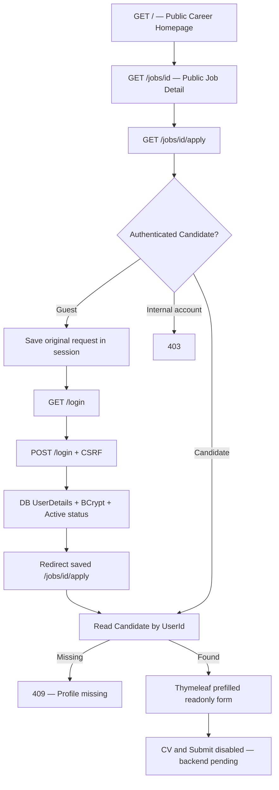

# Homepage → Job Detail → Login → Apply

## Phạm vi và nguồn

Không JWT. Không sửa DB/SQL/seed. Dữ liệu tin tuyển dụng lấy từ `JobPosting`;
UI labels English, nội dung DB được giữ nguyên ngôn ngữ. `Application` hiện yêu cầu
`AppliedCvUrl` NOT NULL nhưng checkout chưa có upload/storage/submit workflow.
Trang Apply hiện **chỉ đọc/prefill**, không tạo đơn.

## 1. Public homepage: từng step

| Step | Package / class / hàm | Xử lý |
|---|---|---|
| 1 | `com.group2.rms.config.SecurityConfig.filterChain()` | GET `/` và `/jobs` public; không bỏ CSRF hoặc authentication cho route khác. |
| 2 | `com.group2.rms.controller.CareerController.viewer(Authentication)` | `@ModelAttribute("viewer")`: Guest nhận null; tài khoản thật gọi service để lấy display name/role. |
| 3 | `CareerController.homepage(Model)` | Nhận GET `/` hoặc `/jobs`; đọc jobs/departments/location options. |
| 4 | `com.group2.rms.service.CareerService.openJobs()` | Gọi repository với `LocalDateTime.now()`, transaction read-only. |
| 5 | `com.group2.rms.repository.JobPostingRepository.findOpenPostings(now)` | JPQL: Published và deadline null hoặc >=now. Cùng định nghĩa active của Dashboard. EntityGraph fetch `requisition.department`; không phụ thuộc open-in-view. |
| 6 | `CareerService.publicJob(JobPosting)` / `lines(String)` | Map public DTO `PublicJob`: PostingTitle, WorkLocation, SalaryDisplay, dates, JD, requirements/benefits; department/type từ requisition. Chỉ chuẩn hóa newline, không dịch. Không trả User/password/internal reason/approval fields. |
| 7 | `CareerService.departments()` → `DepartmentRepository.findAll()` | Tạo DepartmentOption từ DB; department không có open job vẫn xuất hiện với count0. |
| 8 | `CareerController.homepage()` | Departments có openings trước0 (ID từ actual jobs), alphabet trong nhóm; không sửa DB ordering. Model jobs/departments/locations distinct → careers/index. |
| 9 | `templates/careers/index.html` | `th:each="job : ${jobs}"` sinh card; `th:text` escape dữ liệu; URL `/jobs/{jobPostingId}`. Không cards hardcode hoặc jobs array JS. |
| 10 | `static/js/careers.js`, IIFE / `normalize()` / `update()` | JS chỉ đọc DOM card, thực hiện keyword/location/department/count/empty/clear. NFD bỏ dấu và đ/Đ; keyword theo title/department/public JD/requirements. Không gọi backend hoặc tạo job model thứ hai. |

## 2. Job Detail: từng step

1. Link native `<a class="job-link">` có pseudo-element phủ card → GET `/jobs/{id}`.
2. `CareerController.detail(id, model, response)` → `CareerService.openJob(id)`.
3. `JobPostingRepository.findOpenPosting(id, now)` kiểm tra Published/deadline ngay trong query.
4. Không có tin đang mở → HTTP404 + `careers/unavailable`, link Open Positions.
5. Có tin → `careers/detail`; facts salary/date/deadline/location/type/department giữ nguyên.
6. Overview & Responsibilities dùng `JobPosting.JobDescription`; Requirements dùng
   `JobRequirements`; Benefits dùng `Benefits` và link về benefits chung viết một lần.
   Không có cột PreferredQualifications hoặc Responsibilities riêng nên không tự tạo.
7. `careers.js` share handler gọi `navigator.clipboard.writeText(location.href)`;
   chỉ hiện nút khi API/secure context có thật, lỗi có hướng dẫn copy address.
8. Apply Now là link thật `/jobs/{id}/apply`. Không dialog/hash router/mailto.
9. Head fragment nhận `${job.postingTitle}` đã evaluate; availability notice xuất hiện
   trước login. Requirements/benefits là paragraph lines giữ wording và dấu list DB,
   không thêm marker native gây double bullet.

## 3. Guest Apply → login → quay lại đúng URL

| Step | Class / hàm | Xử lý |
|---|---|---|
| 1 | `SecurityConfig.filterChain()` | Apply matcher đứng trước `/jobs/**` public, yêu cầu `ROLE_CANDIDATE`. |
| 2 | Spring Security `AuthorizationFilter.doFilter()` | Guest không đủ quyền. |
| 3 | `ExceptionTranslationFilter.doFilter()` → `HttpSessionRequestCache.saveRequest()` | Lưu GET apply trong session. Cache dùng matchingRequestParameterName=null để không thêm `?continue`. |
| 4 | `LoginUrlAuthenticationEntryPoint.commence()` | Redirect `/login`. |
| 5 | `com.group2.rms.controller.AuthController.loginPage()` | GET login trả `auth/login`; Thymeleaf form POST tạo hidden CSRF tự động. |
| 6 | `CsrfFilter.doFilterInternal()` | POST login thiếu/sai token →403. |
| 7 | `UsernamePasswordAuthenticationFilter.attemptAuthentication()` | Đọc username/password, chuyển tới AuthenticationManager. |
| 8 | `ProviderManager.authenticate()` → `DaoAuthenticationProvider` | Tái dùng provider đã cấu hình. |
| 9 | `com.group2.rms.security.DatabaseUserDetailsService.loadUserByUsername(identifier)` | `UserRepository.findByUsernameIgnoreCase()` và `findByEmailIgnoreCase()`; từ chối identity nhập nhằng. Chỉ Active enabled; authority từ `RoleAuthorities.fromRoleName()`. |
| 10 | `DaoAuthenticationProvider.additionalAuthenticationChecks()` → `BCryptPasswordEncoder.matches()` | So sánh mật khẩu với hash; không decrypt hoặc lưu plaintext. |
| 11 | Spring session authentication / `AbstractAuthenticationProcessingFilter.successfulAuthentication()` | Lưu SecurityContext bằng flow session hiện có, giữ session fixation protection mặc định. |
| 12 | `SavedRequestAwareAuthenticationSuccessHandler.onAuthenticationSuccess()` | Saved request ưu tiên. `defaultSuccessUrl("/dashboard", false)` chỉ là fallback cho login trực tiếp. Không redirect homepage. |
| 13 | Browser GET URL đã lưu | Đi tiếp phần4 dưới đây. |

Sai password → `/login?error`, saved request vẫn trong session để thử lại. Internal account
đăng nhập từ Apply vẫn quay lại URL đó rồi nhận403; không được tự tạo Candidate profile.

## 4. Candidate prefill / form

1. `AccountSessionGuardFilter.doFilterInternal()` đọc User hiện tại bằng username,
   kiểm tra Active và role không đổi. Vi phạm → logout session, `/login?session-expired`.
2. Apply authorization kiểm tra Candidate trước controller.
3. `CareerController.apply(id, authentication, model, response)` kiểm tra job đang mở.
4. `CareerService.candidateDetails(authentication.getName())` → UserRepository lookup
   role Candidate → `CandidateRepository.findByAccountUserId(userId)`.
5. Chỉ đọc profile của User đã xác thực; không nhận candidateId/userId từ form/query.
6. Có User nhưng thiếu Candidate →409/profile missing. Không auto-create, không ghép email.
7. Model `candidate` là `CandidateDetails`: name/email/phone từ User;
   LinkedIn/portfolio/address từ Candidate. Không đưa entity/password hash vào view.
8. `careers/apply.html` render fieldset có legend Read-only trước inputs; optional blank
   placeholder Not provided. Actual values không thay thế/ghi lại. CV/Submit disabled,
   thông báo chưa khả dụng. Browser title có postingTitle thật.
9. JS submit listener `preventDefault()`; nút Submit là disabled `type=button`.
   Không có POST controller hoặc ApplicationRepository.save(). Nếu POST bằng tay:
   thiếu CSRF →403, Candidate+CSRF hợp lệ →405.

Không có note/cover letter/Resume entity mới; không thay User khi xem form. Backend cần
policy CV storage/validation/download/retention và submit/duplicate/profile-edit trước khi mở nộp.

## 5. Header / logout / Talent Pool

1. `CareerController.viewer()` → `CareerService.viewer(username)` → DB fullName/role.
2. `careers/fragments.html :: accountActions`: Guest Sign In/Register; logged-in
   display name/Dashboard/POST Log Out. Cùng fragment cho desktop/mobile.
3. Không có My Profile/My Applications route thật nên không tạo link những trang đó.
4. POST `/logout` + CSRF → Spring `LogoutFilter.doFilter()` →
   `SecurityContextLogoutHandler.logout()` → `/login?logout`.
5. Talent Pool entry hiện gọi đúng “Create a Candidate Account”, Guest → `/register`, tái dùng
   `RegistrationController.form()/register()` → `CandidateRegistrationService.register()` →
   `AccountManagementService.create()`, tạo User+Candidate theo rule đã có.
   CTA chỉ là đăng ký, chưa có talent-pool storage/notifications/subscription riêng.
6. Logged-in bottom CTA → Dashboard thật, không loop về positions hoặc tạo link chết.

## Verification boundary

MockMvc kiểm tra filter/controller/Thymeleaf/CSRF/saved URL và DB reads.
Preview tĩnh chỉ kiểm tra frontend, không nhận POST hoặc tạo session.
Startup Tomcat vẫn lỗi loopback trên máy này; không tuyên bố HTTP/browser login E2E đã PASS.
