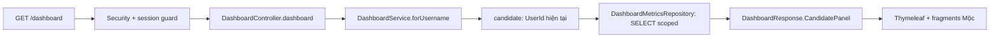

# Luồng Dashboard Candidate — tiếng Việt

Ngày: 04/10/2026. Entry point `/dashboard`; không dùng JWT.

## 1. Mở Dashboard và tải dữ liệu

| Step | Package/class | Hàm | Xử lý |
|---|---|---|---|
| 1 | `com.group2.rms.core.config.SecurityConfig` | `filterChain()` | `/dashboard` yêu cầu authenticated; Guest được chuyển tới `/login` |
| 2 | Spring Security | `SecurityContextHolderFilter.doFilter()` | Đọc Authentication từ SecurityContext/session |
| 3 | `com.group2.rms.core.security.AccountSessionGuardFilter` | `doFilterInternal()` | Đọc User hiện tại; từ chối khi Inactive/Blocked/role thay đổi, logout và redirect |
| 4 | `com.group2.rms.dashboard.DashboardController` | `dashboard(Authentication, Model)` | Lấy `authentication.getName()`, gọi Service; không nhận UserId từ request |
| 5 | `com.group2.rms.dashboard.DashboardService` | `forUsername(String)` | `@Transactional(readOnly=true)`, `UserRepository.findByUsernameIgnoreCase()`; xác nhận Active; switch role Candidate |
| 6 | Cùng Service | `candidate(User, LocalDateTime)` | Lấy UserId từ User đã xác thực; build metrics/breakdowns/panel |
| 7 | `com.group2.rms.dashboard.DashboardMetricsRepository` | `candidateApplications()`, `candidateUpcomingInterviews()`, `candidateOffersAwaitingResponse()` | Count thật; scope `candidate.account.userId = :userId` |
| 8 | Cùng Repository | `candidateApplicationStages()`, `candidateOfferStatuses()` | Tổng hợp ApplicationStatus/OfferStatus; không lấy điểm/nhận xét |
| 9 | Cùng Repository | `candidateRecentApplications(userId,20)` | Chọn title/submissionDate/status, mới nhất trước |
| 10 | Cùng Repository | `candidateNextInterviews(userId,now,10)` | Chỉ Scheduled/Rescheduled, startTime >= now, thời gian sớm nhất trước |
| 11 | Cùng Repository | `candidateOffers(userId,20)` | Chỉ Sent_Candidate/Negotiating/Accepted/Declined; đọc offer chính thức, không join negotiation/approval/internal notes |
| 12 | `DashboardService` | `applicationLabel()`, `offerLabel()`, `safeMeetingUrl()` | Nhãn Việt chỉ ở view; chỉ tạo link http(s) hợp lệ, không userinfo |
| 13 | `com.group2.rms.dashboard.DashboardResponse` | Constructor / nested records | View model chỉ chứa dữ liệu hiển thị và profile công khai của account hiện tại |
| 14 | `DashboardController` | `dashboard()` | `model.addAttribute("dashboard", response)`, trả `dashboard/index` |
| 15 | Thymeleaf | Render `dashboard/index.html` | Candidate: lang/title Việt; nạp head chung, CSS/JS, header/sidebar chung |
| 16 | Thymeleaf | Fragment `dashboard/candidate :: panel(dashboard)` | `th:each` theo panel; `th:text` escape dữ liệu, format dates/salary; render empty/unavailable khi cần |

## 2. Lọc đơn ứng tuyển / thư mời

1. Browser tải `static/js/candidate-dashboard.js`, IIFE tìm `[data-candidate-filter]`.
2. Chỉ bật controls khi list có dữ liệu và JS sẵn sàng. Không JS: list vẫn xem được.
3. Input phát `input`, select phát `change` → closure `update()`.
4. `normalize()` loại combining marks, chuyển Đ/đ thành d; so keyword với title, so select với nhãn status.
5. `update()` đặt `row.hidden`, cập nhật count `role=status`/aria-live, trạng thái không có kết quả.
6. Clear: reset keyword/status và gọi `update()`. Không gọi API, không ghi DB, không chuyển focus/scroll sang section khác. Button được giữ đến khi blur nếu đang có keyboard focus.

Filters áp dụng cho list đã tải, không thay đổi count tổng hay giả một query search toàn DB.

## 3. Điều hướng và xem chi tiết

- Sidebar dùng anchor `/dashboard#applications`, `#interviews`, `#offers`, `#notifications`, `#profile`; vẫn cùng trang, không tạo SPA hay endpoint mới.
- `interface.js`: handler menu + `sync()` quản lý workspace nav tại <=768px, Escape đóng menu.
- Xem thư mời: native `
/
`, có keyboard semantics sẵn, không gọi endpoint. Quyền lợi dùng `th:text` + `white-space:pre-wrap`, không `th:utext`.
- Online: link họp đã kiểm tra URI, mở tab mới với `noopener noreferrer`. Offline: địa điểm escaped.
- “Xem vị trí đang tuyển” → `CareerPortalController.viewPublicJobList()` ở `com.group2.rms.career.controller`; gọi `CareerPortalService.getPublishedJobs()` → `JobPostingRepository.findPublishedJobs()`; trả `candidate/job-board`. Đây là route đã tồn tại, không viết lại trong đợt này.

## 4. Đăng xuất với xác nhận

1. Header chung render form POST `/logout`; Thymeleaf/Spring Security vẫn thêm hidden CSRF.
2. `candidate-dashboard.js` tìm `form[data-confirm-logout]` và native dialog.
3. Submit handler: nếu chưa confirmed → `preventDefault()` → `dialog.showModal()`; focus bắt đầu ở **Ở lại** (`autofocus`).
4. Ở lại → `dialog.close()`; Escape dùng hành vi native; focus trở về nút mở dialog.
5. Xác nhận → `confirmed=true` → disable nút xác nhận → `form.requestSubmit()`; gửi form thật cùng CSRF.
6. Spring Security `CsrfFilter.doFilterInternal()` kiểm tra token, sau đó `LogoutFilter.doFilter()` xử lý URL `/logout`.
7. `SecurityContextLogoutHandler.logout()` xóa context/invalidate session; `SimpleUrlLogoutSuccessHandler.onLogoutSuccess()` redirect `/login?logout` theo SecurityConfig.
8. GET Dashboard sau logout phải đăng nhập lại. **Không có LogoutController tự viết.**

Nếu JS không chạy/native dialog không hỗ trợ, form giữ logout POST trực tiếp; không vô hiệu hóa chức năng đăng xuất.

## 5. Không triển khai mutation / giới hạn

Rút đơn, accept/decline/negotiate, notification/reminder, profile save/change password hiển thị disabled + lý do; không có flow POST mới. Stage riêng và Active/Inactive/Closed của application chưa được tự ánh xạ. Offer Date không dùng CreatedAt giả làm ngày gửi. Không đọc AI score, OverallScore, reviewer comments, interview evaluation, director comments, HRResponseNotes.

## Bằng chứng

[Quá trình sửa](../update%20architecture/2026-10-04-candidate-dashboard-ui.md) · [Test từng bước](../tests/2026-10-04-candidate-dashboard-ui.md). Fixture MockMvc phục vụ kiểm tra frontend, không thay thế E2E dữ liệu thật.
